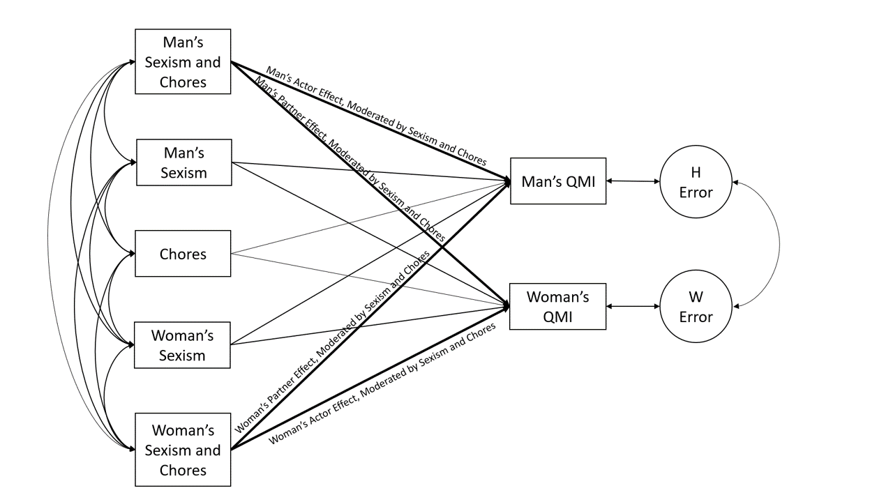

```{r setup, include = FALSE}
library("papaja")
library("tidyverse")
library("lubridate")
library("psych")
library("mosaic")
library("nlme")
library("kableExtra")
r_refs("r-references.bib")
```

```{r analysis-preferences}
# Seed for random number generation
set.seed(42)
knitr::opts_chunk$set(cache.extra = knitr::rand_seed)
```

```{r include = FALSE, message = FALSE, warning = FALSE}
#loading all the files
library(tidyverse)
library(lubridate)
library(psych)
library(mosaic)
library(nlme)
library(kableExtra)
###############################################################################
#PREMEASURES
# Loading the data 
pre <- read_csv("TeleCom_Dyad_premeasures.csv")

pre <- pre %>% 
  select(ResponseId, dyadID, Q138, cohabitation, wfh, gender, sexualor, race, 
         religion, conservatism, people_4_TEXT, people_5_TEXT, indinc, 
         asi_1:asi_22)

# Making ASI numeric
pre <- pre %>%
  mutate(asi_1 = as.numeric(gsub("[a-zA-Z]", "", asi_1)),
         asi_2 = as.numeric(gsub("[a-zA-Z]", "", asi_2)),
         asi_3 = as.numeric(gsub("[a-zA-Z]", "", asi_3)),
         asi_4 = as.numeric(gsub("[a-zA-Z]", "", asi_4)),
         asi_5 = as.numeric(gsub("[a-zA-Z]", "", asi_5)),
         asi_6 = as.numeric(gsub("[a-zA-Z]", "", asi_6)),
         asi_7 = as.numeric(gsub("[a-zA-Z]", "", asi_7)),
         asi_8 = as.numeric(gsub("[a-zA-Z]", "", asi_8)),
         asi_9 = as.numeric(gsub("[a-zA-Z]", "", asi_9)),
         asi_10 = as.numeric(gsub("[a-zA-Z]", "", asi_10)),
         asi_11 = as.numeric(gsub("[a-zA-Z]", "", asi_11)),
         asi_12 = as.numeric(gsub("[a-zA-Z]", "", asi_12)),
         asi_13 = as.numeric(gsub("[a-zA-Z]", "", asi_13)),
         asi_14 = as.numeric(gsub("[a-zA-Z]", "", asi_15)),
         asi_15 = as.numeric(gsub("[a-zA-Z]", "", asi_15)),
         asi_16 = as.numeric(gsub("[a-zA-Z]", "", asi_16)),
         asi_17 = as.numeric(gsub("[a-zA-Z]", "", asi_17)),
         asi_18 = as.numeric(gsub("[a-zA-Z]", "", asi_18)),
         asi_19 = as.numeric(gsub("[a-zA-Z]", "", asi_19)),
         asi_20 = as.numeric(gsub("[a-zA-Z]", "", asi_20)),
         asi_21 = as.numeric(gsub("[a-zA-Z]", "", asi_21)),
         asi_22 = as.numeric(gsub("[a-zA-Z]", "", asi_22)))

# Reverse-coding relevant questions 
pre <- pre %>% 
  mutate(asi_3.r = (1+6) - asi_3,
         asi_6.r = (1+6) - asi_6,
         asi_7.r = (1+6) - asi_7,
         asi_13.r = (1+6) - asi_13,
         asi_18.r = (1+6) - asi_18,
         asi_21.r = (1+6) - asi_21)

# Benevolent correlation matrix
corr.test(select(pre, asi_1, asi_3.r, asi_6.r, asi_8, asi_9, asi_12, asi_13.r, 
                 asi_17, asi_19, asi_20, asi_22))$r

# Hostile correlation matrix
corr.test(select(pre, asi_2, asi_4, asi_5, asi_7.r, asi_10, asi_11, asi_14, 
                 asi_15, asi_16, asi_21.r))$r
#we did not include question 18

# ASI reliability
# Reliability for the benevolent
alpha(select(pre, asi_1, asi_3.r, asi_6.r, asi_8, asi_9, asi_12, asi_13.r, 
             asi_17, asi_19, asi_20, asi_22))
#raw alpha is 0.8001697

# Reliability for the hostile
alpha(select(pre, asi_2, asi_4, asi_5, asi_7.r, asi_10, asi_11, asi_14, 
             asi_15, asi_16, asi_21.r))
#raw alpha is 0.8743657 without question 18

# Benevolent own variable
pre$bs <- rowMeans(select(pre, asi_1, asi_3.r, asi_6.r, asi_8, asi_9, asi_12, 
                          asi_13.r, asi_17, asi_19, asi_20, asi_22))

# Hostile own variable, without question 18
pre$hs <- rowMeans(select(pre, asi_2, asi_4, asi_5, asi_7.r, asi_10, asi_11, 
                          asi_14, asi_15, asi_16, asi_21.r))
###############################################################################
#DAILY
# Loading the data
daily <- read_csv("TeleCom_Dyad_dailydiary.csv")

daily <- daily %>%
  mutate(RecordedDate = mdy_hm(RecordedDate)) %>%
  arrange(dyadID, partID, day, RecordedDate) %>%
  mutate(ResponseID = seq_along(RecordedDate)) %>%
  group_by(partID, day) %>%
  mutate(RecordedDate_lag = lag(RecordedDate), #so we can test if record for second tuesday are plausibly next week
         dist = difftime(RecordedDate, RecordedDate_lag, units = "days"), #recoding as day between
         first_sec = seq_along(RecordedDate), #first tuesday or second tuesday?
         prob = ifelse(first_sec >= 2 & dist < 4, 1, 0)) %>% #second+ tuesday is problematic if it's NOT plausibly next week
  group_by(dyadID, partID) %>%
  arrange(dyadID, partID, RecordedDate) %>%
  mutate(rec_num = seq_along(RecordedDate),
         weekish = ifelse(rec_num > 7, 2, 1), #coding for days beyond 7, most are "week 2"
         day_of_study = ifelse(weekish == 2 | (weekish==1 & first_sec>1), #for people who missed days in week 1
                        (case_when(day == "Monday" ~ 8,
                        day == "Tuesday" ~ 9,
                        day == "Wednesday" ~ 10,
                        day == "Thursday" ~ 11,
                        day == "Friday" ~ 12,
                        day == "Saturday" ~ 13,
                        day == "Sunday" ~ 14)), 
                      case_when(day == "Monday" ~ 1,
                        day == "Tuesday" ~ 2,
                        day == "Wednesday" ~ 3,
                        day == "Thursday" ~ 4,
                        day == "Friday" ~ 5,
                        day == "Saturday" ~ 6,
                        day == "Sunday" ~ 7)),
         week = ifelse(day_of_study > 7, 2, 1)) %>%
  group_by(partID) %>%
  mutate(problems = sum(prob)) %>%
  arrange(desc(problems), dyadID, partID, RecordedDate) %>%
  select(ResponseID, partID_given:day, day_of_study, RecordedDate_lag, dist, 
         first_sec, prob, rec_num,  
          weekish, week, problems, gender:comments)

#remove anyone with 
#(problems > 1) | (problems == 1 & !is.na(partID_given)) 
daily <- daily %>% 
  filter((problems <= 1) | (problems != 1) & (!is.na(partID_given)))

#other problematic cases or IDs to filter out completely: 
#146, 1266, 1278, 1282, 1302, partID == R_1fiPEJydpvuaEEs, R_1jV9NyWEbelB76s,R_1PTxhk4207mTHAb, R_27kuznipTrWICLB, 2800
daily <- daily %>% 
  filter(ResponseID != 146, ResponseID != 1266, ResponseID != 1278,  
         ResponseID != 1282, ResponseID != 1302, ResponseID != 2800) %>% 
  filter(partID != 'R_1fiPEJydpvuaEEs', partID != 'R_1jV9NyWEbelB76s', 
         partID != 'R_1PTxhk4207mTHAb', partID != 'R_27kuznipTrWICLB')

#other problematic cases to fix due to participant error:
daily <- daily %>% 
  mutate(day = ifelse(ResponseID == 494, "Friday", day),
         day = ifelse(ResponseID == 771, "Wednesday", day),
         day = ifelse(ResponseID == 873, "Monday", day),
         day = ifelse(ResponseID == 887, "Monday", day),
         day = ifelse(ResponseID == 1077, "Wednesday", day),
         day = ifelse(ResponseID == 1111, "Saturday", day),
         day = ifelse(ResponseID == 1202, "Wednesday", day),
         day = ifelse(ResponseID == 1219, "Tuesday", day),
         day = ifelse(ResponseID == 1233, "Tuesday", day),
         day = ifelse(ResponseID == 1247, "Tuesday", day),
         day = ifelse(ResponseID == 1365, "Saturday", day),
         day = ifelse(ResponseID == 1771, "Friday", day),
         day = ifelse(ResponseID == 1785, "Friday", day),
         day = ifelse(ResponseID == 2328, "Wednesday", day),
         day = ifelse(ResponseID == 2345, "Saturday", day),
         day = ifelse(ResponseID == 2393, "Wednesday", day),
         day = ifelse(ResponseID == 2516, "Thursday", day),
         day = ifelse(ResponseID == 2680, "Monday", day),
         day = ifelse(ResponseID == 2694, "Monday", day),
         day = ifelse(ResponseID == 2821, "Saturday", day),
         day = ifelse(ResponseID == 2825, "Sunday", day),
         day = ifelse(ResponseID == 2859, "Wednesday", day),
         day = ifelse(ResponseID == 2881, "Sunday", day),
         day = ifelse(ResponseID == 2940, "Thursday", day),
         day = ifelse(ResponseID == 3005, "Monday", day),
         day = ifelse(ResponseID == 3025, "Thursday", day),
         day = ifelse(ResponseID == 3178, "Monday", day),
         day = ifelse(ResponseID == 3192, "Monday", day),
         day = ifelse(ResponseID == 3243, "Sunday", day),
         day = ifelse(ResponseID == 3385, "Wednesday", day),
         day = ifelse(ResponseID == 3399, "Wednesday", day))

daily <- daily %>% 
  mutate(day_of_study = ifelse(ResponseID == 894, 8, day_of_study))

#run again after clean:
daily <- daily %>%
  arrange(dyadID, partID, day, RecordedDate) %>%
  mutate(ResponseID = seq_along(RecordedDate)) %>%
  group_by(partID, day) %>%
  mutate(RecordedDate_lag = lag(RecordedDate), #so we can test if record for second tuesday are plausibly next week
         dist = difftime(RecordedDate, RecordedDate_lag, units = "days"), #recoding as day between
         first_sec = seq_along(RecordedDate), #first tuesday or second tuesday?
         prob = ifelse(first_sec >= 2 & dist < 4, 1, 0)) %>% #second+ tuesday is problematic if it's NOT plausibly next week
  group_by(dyadID, partID) %>%
  arrange(dyadID, partID, RecordedDate) %>%
  mutate(rec_num = seq_along(RecordedDate),
         weekish = ifelse(rec_num > 7, 2, 1), 
         day_of_study = ifelse(weekish == 2 | (weekish==1 & first_sec>1), 
                        (case_when(day == "Monday" ~ 8,
                        day == "Tuesday" ~ 9,
                        day == "Wednesday" ~ 10,
                        day == "Thursday" ~ 11,
                        day == "Friday" ~ 12,
                        day == "Saturday" ~ 13,
                        day == "Sunday" ~ 14)), 
                      case_when(day == "Monday" ~ 1,
                        day == "Tuesday" ~ 2,
                        day == "Wednesday" ~ 3,
                        day == "Thursday" ~ 4,
                        day == "Friday" ~ 5,
                        day == "Saturday" ~ 6,
                        day == "Sunday" ~ 7)),
         week = ifelse(day_of_study > 7, 2, 1))

#selecting just what we want from daily
daily <- daily %>%
  select(partID, dyadID, RecordedDate, day, day_of_study, gender, beds:calls, 
         qmi4)

#making if they did the chore or not numeric
daily <- daily %>%
  select(-cars, -events) %>%
  mutate(beds = if_else(beds == "Yes", 1, 0),
         vacuum = if_else(vaccum == "Yes", 1, 0),
         food = if_else(food == "Yes", 1, 0),
         dishes = if_else(dishes == "Yes", 1, 0),
         garbage = if_else(garbage == "Yes", 1, 0),
         yardwork = if_else(yardwork == "Yes", 1, 0),
         pets = if_else(pets == "Yes", 1, 0),
         laundry = if_else(laundry == "Yes", 1, 0),
         errands = if_else(errands == "Yes", 1, 0),
         finances = if_else(finances == "Yes", 1, 0),
         calls = if_else(calls == "Yes", 1, 0)) %>%
  select(-vaccum) %>%
  distinct()
###############################################################################
#PREPARING FOR MERGE  
#rename the pre so that we can merge them and only include het
pre <- pre %>% 
  rename(partID = ResponseId) %>% 
  filter(sexualor == 'Heterosexual')

pre$gender <- replace(pre$gender, pre$gender == "Woman,Cis gendered", "Woman")
pre$gender <- replace(pre$gender, pre$gender == "Man,Cis gendered", "Man")

#merge the two data sets to prepare for pairwise
total <- merge(daily, pre, by = 'partID')

# Making qmi numeric
total$qmi4 <- replace(total$qmi4, total$qmi4 == 'Mostly true about me', 1)
total$qmi4 <- replace(total$qmi4, total$qmi4 == 'Somewhat true about me', 2)
total$qmi4 <- replace(total$qmi4, total$qmi4 == 'A little true about me', 3)
total$qmi4 <- replace(total$qmi4, total$qmi4 == 'Not true about me', 4)
total <- total %>%
  mutate(qmi4 = as.numeric(qmi4))

#getting rid of any NAs and making them 0
total$beds[is.na(total$beds)] = 0
total$food[is.na(total$food)] = 0
total$dishes[is.na(total$dishes)] = 0
total$garbage[is.na(total$garbage)] = 0
total$yardwork[is.na(total$yardwork)] = 0
total$pets[is.na(total$pets)] = 0
total$laundry[is.na(total$laundry)] = 0
total$errands[is.na(total$errands)] = 0
total$finances[is.na(total$finances)] = 0
total$calls[is.na(total$calls)] = 0
total$vacuum[is.na(total$vacuum)] = 0
################################################################################
#GETTING SUMS
# Summing individual daily chores
total <- total %>%
  rowwise() %>%
  mutate(ind_chores = sum(beds, food, dishes, garbage, yardwork, pets, laundry, errands, finances, calls, vacuum))

# Creating a new dataset with the sum of couple chores
couple_chores <- total %>%
  group_by(dyadID.x, day, day_of_study) %>%
  summarize(cup_chores = sum(ind_chores))

# Joining the individual and couple chore calculations 
total_chores <- merge(couple_chores, total, by = c('dyadID.x', 'day', 'day_of_study'))

# Calculating the percentage of the total chores each individual did
percent <- total_chores %>%
  group_by(dyadID.x, day, day_of_study, gender.x) %>% 
  summarize(daily_per = ifelse(cup_chores != 0, ind_chores / cup_chores, 0)) 

# Joining the individual, couple, and chore percentage calculations
final_before_pairs <- total_chores %>% 
  full_join(percent, by = c("dyadID.x", "gender.x", "day", "day_of_study"))
###############################################################################
#MAKING EVERYTHING DYADIC
# Creating a obsid
final <- final_before_pairs %>%
  mutate(obsid = day_of_study+14*(dyadID.x-1))

#finding whcih ones are greater than 2
filtered_chores <- final %>% 
  group_by(obsid) %>%
  count()

#Problems!!! we need there to only be obsid 2, anything less is fine, but anything
#above is an issue!!!
nomoreProblemshopefully <- filtered_chores %>% 
  filter(n <= 2)

#merging the set that has no problems left with the origional
fixed <- merge(nomoreProblemshopefully, final, by = 'obsid')

#putting everything in the correct order
fixed <- fixed %>% 
  select(dyadID.x, obsid, gender.x, day, day_of_study, qmi4, daily_per, bs, hs, everything())

#creating a set with just the premeasures info 
forlater <- fixed %>% 
  select(dyadID.x, obsid, day, gender.x, Q138:indinc) %>% 
  rename(dyadID = dyadID.x, 
         gender = gender.x)

# Adding gender labels and rearranging the data
pairwise <- fixed %>% 
  mutate(gender2 = gender.x, gender.x = ifelse(gender.x == 'Woman', 'A', 'P')) %>%
  select(dyadID.x, obsid, gender.x, day, day_of_study, qmi4, daily_per, bs, hs, gender2, Q138:indinc) %>% 
  rename(dyadID = dyadID.x)

# Pivoting longer
pairwise2 <- pairwise %>% 
  gather(variable, value, qmi4:Q138:indinc)

# Combining the gender and variable labels
pairwise2 <- pairwise2 %>%
  unite(var_gender, variable, gender.x) 

pairwise2 <- pairwise2 %>% 
  filter(obsid != 411584461, obsid != 411584462, obsid != 411584463, 
         obsid != 411584464, obsid != 411584465, obsid != 411584466,
         obsid != 411584467, obsid != 411584474, obsid != 411584468,
         obsid != 411584469, obsid != 411584470, obsid != 411584471,
         obsid != 411584472, obsid != 411584473)

#spread baby
pairwise2 <- pairwise2 %>% 
  pivot_wider(names_from = var_gender, values_from = value)

#filling in the categories where we know what they should be 
pairwise2$daily_per_A[is.na(pairwise2$daily_per_A)] = 0
pairwise2$daily_per_P[is.na(pairwise2$daily_per_P)] = 0
pairwise2$gender2_A[is.na(pairwise2$gender2_A)] = "Woman"
pairwise2$gender2_P[is.na(pairwise2$gender2_P)] = "Man"

# Adding gender labels and rearranging the data
pairwise3 <- fixed %>% 
  mutate(gender2 = gender.x, gender.x = ifelse(gender.x == 'Woman', 'P', 'A')) %>%
  select(dyadID.x, obsid, gender.x, day, day_of_study, qmi4, daily_per, bs, hs, gender2, Q138:indinc) %>% 
  rename(dyadID = dyadID.x)

# Pivoting longer
pairwise3 <- pairwise3 %>% 
  gather(variable, value, qmi4:indinc)

# Combining the gender and variable labels
pairwise3 <- pairwise3 %>%
  unite(var_gender, variable, gender.x)

pairwise3 <- pairwise3 %>% 
  filter(obsid != 411584461, obsid != 411584462, obsid != 411584463, 
         obsid != 411584464, obsid != 411584465, obsid != 411584466,
         obsid != 411584467, obsid != 411584474, obsid != 411584468,
         obsid != 411584469, obsid != 411584470, obsid != 411584471,
         obsid != 411584472, obsid != 411584473)

#spread baby
pairwise3 <- pairwise3 %>%
  spread(var_gender, value)

#filling in the categories where we know what they should be 
pairwise3$daily_per_A[is.na(pairwise3$daily_per_A)] = 0
pairwise3$daily_per_P[is.na(pairwise3$daily_per_P)] = 0
pairwise3$gender2_A[is.na(pairwise3$gender2_A)] = "Man"
pairwise3$gender2_P[is.na(pairwise3$gender2_P)] = "Woman"
###############################################################################
#MAKING IT PAIRWISE
#joining the datasets together
dyad_pair <- bind_rows(pairwise2, pairwise3) %>%
  arrange(obsid)
###############################################################################
#CALCULATING ICCS
#need to make man and woman 1, woman 0
workin <- dyad_pair %>% 
  mutate(gender2_A = ifelse(gender2_A == 'Woman', 0, 1),
         gender2_P = ifelse(gender2_P == 'Woman', 0, 1))

#making sure thats numeric bc idk why its not working
workin <- workin %>%
  mutate(gender2_A = as.numeric(gender2_A),
         gender2_P = as.numeric(gender2_P),
         qmi4_A = as.numeric(qmi4_A),
         qmi4_P = as.numeric(qmi4_P))

#now we running this to find the ICC for qmi
qmigoals  <- lme(qmi4_A~1,
                 data = workin, 
                 random = ~ gender2_A - 1|dyadID,
                 correlation = corCompSymm(form = ~1|dyadID/obsid),
                 weights = varIdent(form = ~1|gender2_A),
                 na.action = na.omit)
summary(qmigoals)

#now finding the ICC for percent of chores
workinpart2electricboogaloo <- workin %>%
  mutate(gender2_A = as.numeric(gender2_A),
         gender2_P = as.numeric(gender2_P),
         daily_per_A = as.numeric(daily_per_A),
         daily_per_P = as.numeric(daily_per_P))

#now running to find the ICC for average daily chores
percentlme <- lme(daily_per_A ~1,
                 data = workinpart2electricboogaloo, 
                 random = ~ gender2_A - 1|dyadID,
                 correlation = corCompSymm(form = ~1|dyadID/obsid),
                 weights = varIdent(form = ~1|gender2_A),
                 na.action = na.omit)
summary(percentlme)

#now making something for just the first rows of HS 
hsmodel <- dyad_pair %>% 
  group_by(dyadID, gender2_A) %>%
  arrange(hs_A) %>%
  filter(row_number()==1)

#making sure its numeric
hsmodel <- hsmodel %>% 
  mutate(hs_A = as.numeric(hs_A))

#running the model to find the ICCs for HS
hsfunction <- gls(hs_A ~ 1,
                  data = hsmodel,
                  correlation = corCompSymm(form=~1|dyadID), 
                  weights = varIdent(form=~1|gender2_A), 
                  na.action = na.omit)
summary(hsfunction)

#now making one for BS
bsmodel <- dyad_pair %>% 
  group_by(dyadID, gender2_A) %>%
  arrange(bs_A) %>%
  filter(row_number()==1)

#making sure its all numeric
bsmodel <- bsmodel %>% 
  mutate(bs_A = as.numeric(bs_A))

#running for the ICCS for bs
bslme <- gls(bs_A ~ 1,
             data = bsmodel,
             correlation = corCompSymm(form=~1|dyadID), 
             weights = varIdent(form=~1|gender2_A), 
             na.action = na.omit)
summary(bslme)
###############################################################################
#DEMOGRAPHICS
demographics <- dyad_pair %>%
  filter(day_of_study == 1) %>%
  select(dyadID, gender2_A, Q138_A, cohabitation_A, wfh_A, race_A, race_P, religion_A, conservatism_A, people_4_TEXT_A, people_5_TEXT_A, indinc_A)

relationship <- demographics %>%
  select(dyadID, Q138_A) %>%
  distinct() %>%
  group_by(Q138_A) %>%
  summarize(n = n())

relationship %>%
  summarize(total = sum(n))

# dyads 7403083 and 29676367 may or may not be married

relationship_cleaned <- demographics %>%
  select(dyadID, Q138_A) %>%
  filter(dyadID != 7403083, dyadID != 29676367) %>%
  distinct() %>%
  group_by(Q138_A) %>%
  summarize(n = n())

relationship_cleaned %>%
  summarize(total = sum(n))

cohab <- demographics %>%
  select(dyadID, cohabitation_A) %>%
  distinct() %>%
  group_by(cohabitation_A) %>%
  summarize(n = n())

cohab %>%
    summarize(total = sum(n))

children <- demographics %>%
  select(dyadID, people_4_TEXT_A, people_5_TEXT_A) %>%
  mutate(kids = as.numeric(people_4_TEXT_A),
         teens = as.numeric(people_5_TEXT_A)) %>%
  select(dyadID, kids, teens) %>%
  replace(is.na(.), 0) %>%
  mutate(total_children = kids + teens) %>%
  select(dyadID, kids, teens, total_children) %>%
   distinct() %>%
  group_by(total_children) %>%
  summarize(n = n())

children %>%
  summarize(total = sum(n))

testing_kids <- demographics %>%
  select(dyadID, people_4_TEXT_A, people_5_TEXT_A) %>%
  mutate(kids = as.numeric(people_4_TEXT_A),
         teens = as.numeric(people_5_TEXT_A)) %>%
  select(dyadID, kids) %>%
  group_by(dyadID, kids) %>%
  summarize(n = n()) %>%
  filter(n <2)

# dyads 29508533 and 29237405 may either have 1 or 2 kids
# dyad 18756718 may have either 0 or 2 kids

testing_teens <- demographics %>%
  select(dyadID, people_4_TEXT_A, people_5_TEXT_A) %>%
  mutate(kids = as.numeric(people_4_TEXT_A),
         teens = as.numeric(people_5_TEXT_A),
         total_children = kids + teens) %>%
  select(dyadID, teens) %>%
  group_by(dyadID, teens) %>%
  summarize(n = n()) %>%
  filter(n <2)

# dyad 18324617 has 1 or 2 teens
# dyad 18756718 has 2 or 4 teens (2 from kids?)
# dyad 29508533 has 0 or 1 teens (1 from kids)
# dyad 29725014 has 2 or 1 teens

cleaner_children <- demographics %>%
  select(dyadID, people_4_TEXT_A, people_5_TEXT_A) %>%
  mutate(kids = as.numeric(people_4_TEXT_A),
         teens = as.numeric(people_5_TEXT_A)) %>%
  select(dyadID, kids, teens) %>%
   filter(dyadID != 29508533, dyadID != 29237405, dyadID != 18756718, 
          dyadID != 18324617, dyadID != 29725014) %>%
  replace(is.na(.), 0) %>%
  mutate(total_children = kids + teens) %>%
  select(dyadID, total_children) %>%
  filter(total_children != 0) %>%
  distinct() %>%
  add_row(dyadID = 29508533, total_children = 2) %>%
  group_by(total_children) %>%
  summarize(n = n())

more_than_one <- cleaner_children %>%
  summarize(total = sum(n)) 

cleaner_children <- cleaner_children %>%
  add_row(total_children = 0, n = 264/2 - more_than_one$total)
  

cleaner_children %>%
  summarize(total = sum(n)) 

ind_race <- demographics %>%
  group_by(race_A) %>%
  summarize(n = n())

ind_race %>%
  summarize(total = sum(n))

mixed_race_couples <- demographics %>%
  filter(race_A != race_P) %>%
  select(dyadID) %>%
  distinct()

mixed_race_couples %>%
  summarize(n = n())

religion <- demographics %>%
  group_by(religion_A) %>%
  summarize(n = n())

religion %>%
    summarize(total = sum(n))

politics <- demographics %>%
  select(conservatism_A) 

politics <- politics %>% 
  mutate(conservatism_A = ifelse(conservatism_A == '2', 2, conservatism_A),
         conservatism_A = ifelse(conservatism_A == '3', 3, conservatism_A),
         conservatism_A = ifelse(conservatism_A == '5', 5, conservatism_A),
         conservatism_A = ifelse(conservatism_A == '6', 6, conservatism_A),
         conservatism_A = ifelse(conservatism_A == 'Center4', 4, conservatism_A),
         conservatism_A = ifelse(conservatism_A == 'Far left (Liberal)1', 1, conservatism_A),
         conservatism_A = ifelse(conservatism_A == 'Far right (conservative)7', 7, conservatism_A)) %>% 
  na.omit

ggplot(data = politics, mapping = aes(x = conservatism_A, fill = conservatism_A)) +
  geom_bar() +
  scale_fill_brewer(palette = 'RdPu') +
  labs(title = "Political Spectrum of Participants", x = 'Level of Conservatism', y = 'Count', fill = 'Level of Conservatism, but Pretty') +
  theme_classic()
  

politics %>%
  mutate(conservatism_A = as.numeric(conservatism_A)) %>% 
  summarize(n = n(),
            mean = mean(conservatism_A),
            sd = sd(conservatism_A))
```

# Introduction

For many decades, women in dual-earner households were found to do a significant portion of the housework [@Bareket], thus creating a so-called “second shift” of work for women when they returned home. In May of 2020, as the devastation of the COVID-19 pandemic began to set in, nearly 48% of the Americans that had previously commuted to work in February were either working from home or unemployed [@Bick]. As a result of the pandemic, the entire American workforce was rearranged, leading to a dual purpose of the current study. The first is to synthesize previous research findings on the relationship between sexism, marital satisfaction, and the division of housework in the context of romantic relationships, while determining whether these findings hold true during such unprecedented times. The second is to explore these concepts through a dyadic lens, by looking at the experiences of both partners within a heterosexual relationship. 

## Sexism in Romantic Couples

When looking at the mechanisms that play into the differences within and between heterosexual couples, it is important to acknowledge the different forms of sexism that occur. Under the theory of ambivalent sexism, there are two forms of sexism.  The first is hostile sexism (HS): where women are treated with resent, and often aggression. The second is benevolent sexism (BS): where women are cared for, but seen as helpless and incompetent [@Glick1996]. Furthermore, BS and HS interact to create the structure of gender inequality that is present within our modern-day society. While HS punishes women for breaking traditional gender roles, BS rewards them for taking on traditionally feminine roles [@Glick2001]. As a result, ambivalent sexism has a strong influence on interpersonal relationships. Within a romantic couple, men who are higher in BS tend to seek women who fulfill more traditional gender roles [@Thomae]. Moreover, men who are high in HS seek women who are high in BS, and vice versa [@Lee]. Individuals who are higher in either form of sexism are more likely to have partnerships that fit more traditional gender prescriptions. 

Additionally, @Hammond found that women who were high in BS experienced very high relationship satisfaction if their benevolent ideals were met, but very low satisfaction if they weren’t. Conversely, they found that a man's relationship satisfaction had more to do with his overall status (inside and outside the home) than on his partner’s fulfillment of her gender role. @Minnotte show that the relationship between gender ideologies and marital satisfaction is complex. In their study, when husbands were lower in sexism and the household was more egalitarian, husbands reported less relationship satisfaction. This indicates that in addition to behaviors and reported beliefs, there are unseen factors that influence gender bias. @Lee also found that even when Americans don’t directly endorse BS attitudes, they are still likely to be guided by BS when choosing their partners, highlighting how even in instances where people don’t present bias outwardly, they are often still influenced by gender ideologies.

## Dividing Housework

A prominent manner of observing bias from gender ideologies is through the division of household labor. Typically, women do more frequent, routine chores, such as cleaning, and men do more occasional, intermittent chores, such as car maintenance [@Barstad]. This leads to a misalignment, where even with increasing gender equality within the workforce, women are doing disproportionately more work [@Helms]. It is important to note that calculations of housework are often biased. Stereotypical men and women engage in different types of chores, so any calculation based on a set list of chores may miss the larger picture of how the couple chooses to divide their work on any given day [@Nordenmark]. Regardless, focusing specifically on only traditionally feminine tasks allows us to highlight the gender mismatch in the proportion of everyday tasks taken on by different members of a household.

While dual-earning heterosexual households may have more egalitarian divisions of housework [@Chesters], the divisions are still uneven. In fact, @Barstad found that in the cases in which there is greater equality in the division of household labor, it is because the women have decreased their housework, as opposed to the men taking on more. This leads to an inequity  where women and men have different concepts of what equal division of housework may mean. Additionally, division of housework is influenced heavily by the individual partners’ work environments, especially when the partners are not dual earners. When husbands  work or earn more than their wives, wives end up taking on a larger proportion of the housework [@Lam]. Similarly, when husbands are dealing with stress from work that extends back to their home, the wife is more likely to take on more work [@Lam; @Huffman].  This last finding is particularly relevant to the context of the COVID-19 pandemic, in which many couples have been forced to work from home. In order to gain insight into the process through which chores are divided, it is important to determine how couples are responding to changes in status and the spillover of work-family conflict during these unprecedented times.

## Sexism and Marital Satisfaction Linked with Division of Housework

Many of the factors that influence the ways in which housework is divided are linked closely with sexism. In general, when couples exhibit more traditional gender ideologies, the woman is likely to do more housework [@Erickson]. When one partner exhibits different sexist beliefs than the other, the division of household labor continues to be uneven [@Bareket]. In studying attitudes toward provider roles, @Helms found that those who endorse the main-secondary provider and ambivalent coprovider attitudes — those that relate most closely to BS beliefs [@Carlson] — the wife is more likely to do the majority of the housework. @Doan found that it is much more common and acceptable for the wife to take on masculine tasks in addition to feminine (routine) ones than it is for the husband to take on any of the feminine tasks. This leads to an imbalance in which women are often left doing more work than men. At the same time, according to @Poortman, one of the main underlying causes of unequal division of household labor is because women prefer to do the routine house chores. In many cases, the wife’s prescriptions guide her to take on a traditional role within the household. Additionally, although the husband has traditionally had a more dominant role in determining the gender roles within the relationship [@Lam; @Huffman], the wife also has a strong influence on whether the division of housework will be more traditional or not. When the wife endorses more traditional gender ideologies, even if the husband doesn’t, the wife is likely to do more housework [@Greenstein1996]. When the wife does not endorse BS, it is more likely for there to be an equal division of housework [@Helms]. While many studies have looked individually at the effect that the husband’s and the wife’s sexist attitudes have on their division of household labor, less have looked at *how* the relationship between their gender ideologies may have an impact.

There is also a strong link between division of household labor and feelings of marital satisfaction. Feelings of fairness and equality within the partnership are more strongly linked to the distribution of housework than to the division of paid work [@Nordenmark]. In countries with more gender-equity, such as America, the distribution of household chores has a considerable effect on feelings of fairness [@Greenstein2009]. Interestingly, there are also strong relationships between the division of household labor and relationship quality in women. Women feel low levels of satisfaction when men do little to no routine housework, but also don’t enjoy doing intermittent (masculine) tasks [@Barstad]. Coupled with gender ideologies, division of household labor has a strong impact on feelings of marital satisfaction. When the wife takes on less of a traditional role and participates more in the workforce, she is less likely to be satisfied with doing more housework [@Braun]. Similarly, people who endorse different sexist beliefs are likely to have different perceptions about what divisions of housework are equitable, influencing feelings about fairness, teamwork, and marital quality [@Bareket; @Nordenmark]. It is rare for two partners to share the exact same gender ideologies, and gender ideologies have an impact on the division of housework and on overall marital satisfaction. Each individual person’s beliefs have an impact on their own feelings, but also on their partner’s, making it important to investigate these variables from a dyadic perspective.

## Current Study

Previous research shows that there are links between sexism and division of household labor, sexism and marital satisfaction, and division of household labor and marital satisfaction. While some research looks at the relationship between all three of these variables, it fails to address the relationship that the two partners have with each other. In this study, we attempted to gain a more holistic understanding of how the interaction between partners influences their individual attitudes towards sexism, feelings about the quality of the relationship, and the percentage of housework that they are a part of. Couples were asked about their feelings about their relationship and the household chores that they did for two weeks, with the goals of (1) determining the extent to which the husbands’ and the wives’ attitudes of sexism impacted their own and each other’s feelings of marital satisfaction, and (2) the extent to which division of labor may have acted as a moderator between the two variables. We approached the data dyadically, using the Actor-Partner Interdependence Model [APIM; @Kenny]. This allowed us to operate under the assumption that the romantic partners are not independent from each other, and to investigate the effects both the respondents (actors) and their partners (partners) had on each other.

Our first hypothesis was that individuals who were higher in sexism would have higher feelings of marital satisfaction if their partners were also higher in sexism. Given the findings by @Thomae and @Lee, we hypothesized that this would be especially true for scenarios in which women were high in BS and men were high in either HS or BS (Hypothesis 1a). Our second hypothesis was that the relationship between sexism and marital quality would be moderated by the division of household labor. More specifically, we predicted that when both partners were higher in sexism, and the division of housework would be more traditional, with the woman doing more routine housework,  causing both partners to have greater feelings of satisfaction (Hypothesis 2a). In instances where one partner was higher in sexism than the other, we predicted that the division of housework would be traditional, and that the man would be more satisfied (Hypothesis 2b); if the woman was high in sexism, she would be as satisfied or more satisfied than the man (Hypothesis 2c); if she was low in sexism, she would be less satisfied than the man (Hypothesis 2d). Lastly, if both partners were low in sexism and the division of housework was more egalitarian, both partners would be satisfied (Hypothesis 2e). While each of these hypotheses was drawn from empirical literature that described the relationship of these components on an individual level, we anticipated that there may be contradictory findings once we take into account the potential dyadic interaction within each couple for these variables. 


# Methods

## Measures

### Hostile and Benevolent Sexism 

See table 1 for correlation matrix between sexism scores. Hostile sexism (HS) and benevolent sexism (BS) were measured using a modified version of the Ambivalent Sexism Inventory (ASI) created by @ASI. The original scale includes 22 questions with 11 for both subcategories of sexism; however, we removed question 18, “There are actually very few women who get a kick out of teasing men by seeming sexually available and then refusing male advances”. Participants did not appear to understand the wording of the question, and responses were inconsistent with their other answers. Therefore, our final measure includes 10 questions assessing HS and 11 assessing BS. For each measure we calculated an average, with a higher score for either scale indicating higher sexist beliefs. Alphas for HS and BS were .87 and .80, respectively and the intraclass correlations were .59 and .32.  

### Division of Labor

To calculate the division of household labor we asked each participant to complete 14 daily surveys, in which they were given a list of routine chores and were asked to indicate, “Today, did you spend any time on the following household chores? (Yes or No)" Since we are looking to isolate routine chores, we chose to omit intermittent chores from our calculation of housework. We removed the responses to the categories “Took care of our cars today (sent to repairs, washing, vacuuming)” and “Prepared for events and activities today (for example, birthdays or anniversaries)”. We also chose not to include text responses of additional chores because most of them fell into other chore categories or were better described as intermittent. There were 11 remaining chores (e.g., laundry, cooking, yardwork, etc.), with which we calculated the proportion of chores performed by each partner. The proportion was calculated as the sum of chores one partner did on a given day divided by the sum of chores performed by both partners on a given day. We left this amount as a decimal, so if a partner performed all the chores for that day they had a score of one, and if they performed no chores they had a score of zero. So higher scores indicate a larger proportion of chores done and lower scores indicate a smaller proportion of chores performed on a given day. We also coded it so if no chores were performed on a certain day by either partner, both partners received a zero. The intraclass correlation was .38, which means that there is a relatively low correlation between partners chores performed per day. This sparked our interest, because it seems unlikely that the amount of chores one partner performs would not effect the amount of chores another partner performs. We believe this is likely due to the way we coded if no chores were performed, then both partners received a zero. 


### Teamliness

In order to assess feelings about working together as partners, participants were asked about the degree to which they identified with the statement: “Today, my partner and I are really a team” in their daily diaries. Their answers were scored on a four point scale, with possible responses ranging from *1. mostly true about me* to *4. not true about me*. A higher score was associated with lower feelings about the quality of teamwork for the day. The intraclass correlation for this variable had an absolute value of 0.91. This means that there is a strong correlation between one partners feelings of teamliness and the other partners. 


## Participants

While the original data set included 364 participants of all identities, it predominantly consists of heterosexual individuals (*n* = 353). In order to examine division of labor along gender lines, it was necessary to restrict the data set to male-female couples. Due to the small number of male-female couples that included an individual who was not heterosexual, we decided to restrict our sample further to only include heterosexual couples. Additionally, since all of the couples were living together, we included both couples who were married and those who were in long-term relationships. Regardless of marital status, couples who have lived together for some time need to find ways to divide their housework, and are therefore relevant to our study.

After exclusions and missing data, we were left with 272 individuals (136 dyads). Of these participants, there were 127 married couples, 7 couples that were in committed, long-term relationships, and 2 couples where one individual answered that they were married and the other answered that they were in a long-term relationship. All 136 of the couples answered that they were living together. Notably, 50 participants did not answer any of the demographic information. In these cases, the partner’s information was used to calculate these numbers when appropriate. When looking at other household members, 45 of the couples had children under the age of 18 living in their homes. 36 had one child, 31 had two, 13 had three, and 5 had four. Additionally, one couple reported having ten children, and another reported having 26. These two cases may have been participant error when they were inputting the amount of children in their households as text answers. Five couples had one individual report a different number of children than the other. Those who did not answer the question were coded as having no children. 

A majority of the participants were White (_n_ = 165, 61%). 24 participants identified as Asian (9%), 17 identified as Black or African American (6%), 9 identified as Hispanic or Latinx (3%), 2 as Middle Eastern (1%), 3 as White and Hispanic/Latinx (1%), and 52 either did not answer or chose the “prefer not to answer” option (19%). Nine of the couples were mixed-race couples (6%). A majority of the individuals identified themselves as Christian (_n_ = 150, 55%). A wide assortment of other religions were also represented, but none had more than 15 people affiliated with them. In terms of political affiliations, there was a pretty equal distribution along the spectrum. This was calculated on a seven point spectrum with 1 equating to far left (liberal), 4 equating to center, and 7 equating to far right (conservative). Most of the individuals were at or around the center of the spectrum, with a slight skew towards conservatism (mean = 4.23, SD = 1.67).

```{r table, include = FALSE, warning = FALSE, message = FALSE, display = FALSE}
#finding the means and SD for HS based on gender
hsmodel %>% 
  group_by(gender2_A) %>%
  na.omit(hs_A) %>% 
  summarize(n= n(),m = mean(hs_A), sd = sd(hs_A))

#finding the means and SD for BS based on gender
bsmodel %>% 
  group_by(gender2_A) %>% 
  na.omit(bs_A) %>% 
  na.omit(hs_A) %>% 
  summarize(n = n(), m = mean(bs_A), sd = sd(bs_A))

#creating a new data set to find the correlation matrix and the p-values
corr_data <- pairwise2 %>%
  filter(day_of_study == 1) %>%
    mutate(bs_W = as.numeric(bs_A),
           hs_W = as.numeric(hs_A),
           bs_H = as.numeric(bs_P),
           hs_H = as.numeric(hs_P)) %>%
  select(bs_W, hs_W, bs_H, hs_H)

#the package we will use to find it 
library(corrplot)
source("http://www.sthda.com/upload/rquery_cormat.r")

#the table itself, we will not be using this, but we will be using the values
corr_tab <- rquery.cormat(corr_data)
corr_tab$r
corr_tab$p

corrtab <- data.frame(
  'Scales' = c('1X Male Hostile Sexism', '2X Male Benevolent Sexism', 
               '3X Female Hostile Sexism', '4X Female Benevolent Sexism'),
  'Mean' = c(3.56, 3.95, 3.23, 3.71),
  'SD' = c(0.810, 0.696, 1.01, 0.72),
  '1' = c('1', '.038', '.54', '.3'),
  '2' = c('.038', '1', '.3', '.37'),       
  '3' = c('.54', '.3', '1', '.53'),
  '4' = c('.3', '.37', '.53', '1')
)
```

```{r echo = FALSE}
#creating the sexy sexy table for it 
apa_table(corrtab,
  caption = "Correlation Matrix Between Sexism Scores",
  note = "Possible scores for hostile and benevolent sexism ranged from 1 to 7. All correlations except for male hostile sexism with male benevolent sexism was statistically signficinat with p < .01")
```

# Results

```{r mods, include = FALSE}
##### INITIAL MODEL WITH ONLY GENDER #####
#making it so the day is subtracted by 1
dyad_pair2 <- dyad_pair %>% 
  mutate(time = day_of_study -1,
         qmi4_A = as.numeric(qmi4_A),
         time = as.numeric(time),
         daily_per_A = as.numeric(daily_per_A),
         daily_per_P = as.numeric(daily_per_P),
         hs_A = as.numeric(hs_A),
         bs_A = as.numeric(bs_A),
         hs_P = as.numeric(hs_P),
         bs_P = as.numeric(bs_P)) %>%
  filter(gender2_A == 'Woman' | gender2_A == 'Man')

#basic dyadic growth curve model (no division of labor or sexism model)
dyadicmodelbaby  <- lme(qmi4_A ~ gender2_A + gender2_A:time  - 1, #making use of two intercept model
                      #gender that is a character string and day of study is time 
                      #dont want grand intercept for everyone so use :
                      data = dyad_pair2, 
                      random = ~ gender2_A + gender2_A:time  - 1|dyadID, 
                      #using again same character string
                      correlation = corCompSymm(form = ~1|dyadID/obsid), 
                      #dyadic thing allows for the covariance within a particular day 
                      weights = varIdent(form = ~1|gender2_A), #get two seperate residual variances
                      na.action = na.omit)

#could use small summary or summary fully 
summary(dyadicmodelbaby)
#the outpit  is bat shit 
#where the man and women are to begin for the intercepts
#predicted overall grand slope for men and women, women are actually stable!
#mess of random effects, and all the standard deviations 
#correlations (just interpret it as a correlation matrix)
#we have done correlation matrixes

##### GENDER AND PERCENT OF LABOR FOR ACTOR #####
dailyandgender_A  <- lme(qmi4_A ~ gender2_A + gender2_A:time + gender2_A:daily_per_A - 1, #making use of two intercept model
                      #gender that is a character string and day of study is time 
                      #dont want grand intercept for everyone so use :
                      data = dyad_pair2, 
                      random = ~ gender2_A + gender2_A:time - 1|dyadID, 
                      #using again same character string
                      correlation = corCompSymm(form = ~1|dyadID/obsid), 
                      #dyadic thing allows for the covariance within a particular day 
                      weights = varIdent(form = ~1|gender2_A), #get two seperate residual variances
                      na.action = na.omit)

summary(dailyandgender_A)

##### GENDER AND PERCENT OF LABOR FOR PARTNER #####
dailyandgender_P  <- lme(qmi4_A ~ gender2_A + gender2_A:time  + gender2_A:daily_per_P- 1, 
                      data = dyad_pair2, 
                      random = ~ gender2_A + gender2_A:time - 1|dyadID, 
                      correlation = corCompSymm(form = ~1|dyadID/obsid), 
                      weights = varIdent(form = ~1|gender2_A), 
                      na.action = na.omit)

summary(dailyandgender_P)

##### INCLUDING THE DAILY PERCENT FOR BOTH THE PARTNER AND ACTOR #####
#if theres no stat significant then we are going we dont combine with gender for actor
dailyandgender_Parttwo  <- lme(qmi4_A ~ gender2_A + gender2_A:time  + gender2_A:daily_per_P + gender2_A:daily_per_A - 1, 
                      data = dyad_pair2, 
                      random = ~ gender2_A + gender2_A:time - 1|dyadID, 
                      correlation = corCompSymm(form = ~1|dyadID/obsid), 
                      weights = varIdent(form = ~1|gender2_A), 
                      na.action = na.omit)

summary(dailyandgender_Parttwo)

##### TESTING IF THERE IS A DIFFERENCE BETWEEN MEN AND WOMEN IN DAILY PER ACTOR #####
checkinbaby  <- lme(qmi4_A ~ gender2_A:daily_per_A - 1,
                      data = dyad_pair2, 
                      random = ~ gender2_A   - 1|dyadID,
                      correlation = corCompSymm(form = ~1|dyadID/obsid),  
                      weights = varIdent(form = ~1|gender2_A),
                      na.action = na.omit)

summary(checkinbaby)

##### JUST HOSTILE SEXISM #####
justhostile <- lme(qmi4_A ~ gender2_A + gender2_A:time  + gender2_A:hs_A - 1, 
                      data = dyad_pair2, 
                      random = ~ gender2_A + gender2_A:time - 1|dyadID, 
                      correlation = corCompSymm(form = ~1|dyadID/obsid), 
                      weights = varIdent(form = ~1|gender2_A), 
                      na.action = na.omit)

summary(justhostile)

##### JUST BENEVOLENT SEXISM #####
justbenevolent <- lme(qmi4_A ~ gender2_A + gender2_A:time  + gender2_A:bs_A - 1, 
                      data = dyad_pair2, 
                      random = ~ gender2_A + gender2_A:time - 1|dyadID, 
                      correlation = corCompSymm(form = ~1|dyadID/obsid), 
                      weights = varIdent(form = ~1|gender2_A), 
                      na.action = na.omit)

summary(justbenevolent)

##### DAILY PER FOR JUST THE ACTOR LOL #####
yeall  <- lme(qmi4_A ~ gender2_A + gender2_A:time  
              + gender2_A:daily_per_P 
              + gender2_A:daily_per_A  
              + gender2_A:hs_A 
              + gender2_A:bs_A
              + gender2_A:hs_P 
              + gender2_A:bs_P
              + gender2_A:daily_per_A:hs_A 
              + gender2_A:daily_per_P:hs_A
              + gender2_A:daily_per_A:hs_P 
              + gender2_A:daily_per_P:hs_P
              + gender2_A:daily_per_A:bs_A 
              + gender2_A:daily_per_P:bs_A
              + gender2_A:daily_per_A:bs_P 
              + gender2_A:daily_per_P:bs_P- 1, 
                      data = dyad_pair2, 
                      random = ~ gender2_A + gender2_A:time - 1|dyadID, 
                      correlation = corCompSymm(form = ~1|dyadID/obsid), 
                      weights = varIdent(form = ~1|gender2_A), 
                      na.action = na.omit)

summary(yeall)

# Removing the non-statistically significant interactions
#this has the interaction effect-so when she isnt doing any chroes
boing  <- lme(qmi4_A ~ gender2_A + gender2_A:time + gender2_A:hs_P + gender2_A:daily_per_P + gender2_A:daily_per_P:hs_P - 1, 
              data = dyad_pair2, 
              random = ~ gender2_A  - 1|dyadID, 
              correlation = corCompSymm(form = ~1|dyadID/obsid), 
              weights = varIdent(form = ~1|gender2_A), 
              na.action = na.omit)
summary(boing)

#remove the interaction effect so we are no longer making sure that the partner is doing no chores
boing_2  <- lme(qmi4_A ~ gender2_A + gender2_A:time + gender2_A:hs_P + gender2_A:daily_per_P - 1, 
              data = dyad_pair2, 
              random = ~ gender2_A  - 1|dyadID, 
              correlation = corCompSymm(form = ~1|dyadID/obsid), 
              weights = varIdent(form = ~1|gender2_A), 
              na.action = na.omit)
summary(boing)


#have interaction term and report significances 

#then remove and report again

#hostile sexism when pafrtnern chores are zero 
#partner effect for hostile sexism for the man effects his teamlinees when she is not doing any chores


#over the two weeks the women become less satisfied
#the more her partner is doing chores the less teamliness she feels 

##### ADDING SEXISM #####
addingsexism  <- lme(qmi4_A ~ gender2_A + gender2_A:time + gender2_A:daily_per_P 
                     + gender2_A:daily_per_A +gender2_A:bs_A + gender2_A:hs_A - 1, 
                      data = dyad_pair2, 
                      random = ~ gender2_A + gender2_A:time - 1|dyadID, 
                      correlation = corCompSymm(form = ~1|dyadID/obsid), 
                      weights = varIdent(form = ~1|gender2_A), 
                      na.action = na.omit)

summary(addingsexism)

##### GENDER AND SEXISM #####
hewo <- lme(qmi4_A ~ gender2_A + gender2_A:bs_A  + gender2_A:hs_A- 1, 
                      data = dyad_pair2, 
                      random = ~ gender2_A - 1|dyadID, 
                      correlation = corCompSymm(form = ~1|dyadID/obsid), 
                      weights = varIdent(form = ~1|gender2_A), 
                      na.action = na.omit)

summary(hewo)

##### PLAYING AROUND #####
full_model <- lme(qmi4_A ~ gender2_A + gender2_A:time + gender2_A*daily_per_A*bs_A + gender2_A*daily_per_A*bs_P + gender2_A*daily_per_A*hs_A + gender2_A*daily_per_A*hs_P - 1, 
                  data = dyad_pair2, 
                  random = ~ gender2_A + gender2_A:time - 1|dyadID, 
                  correlation = corCompSymm(form = ~1|dyadID/obsid), 
                  weights = varIdent(form = ~1|gender2_A), 
                  na.action = na.omit)
summary(full_model)

# a horrifyingly large table
experiment <- lme(qmi4_A ~ gender2_A + gender2_A:time + gender2_A*daily_per_A*bs_A*bs_P*hs_A*hs_P - 1, 
                  data = dyad_pair2, 
                  random = ~ gender2_A + gender2_A:time - 1|dyadID, 
                  correlation = corCompSymm(form = ~1|dyadID/obsid), 
                  weights = varIdent(form = ~1|gender2_A), 
                  na.action = na.omit)
summary(experiment)

##### RECHECKING INTERACTION APPROACH #####
timeandgender  <- lme(qmi4_A ~ gender2_A + time + gender2_A*time, 
                      data = dyad_pair2, 
                      random = ~ gender2_A + gender2_A:time - 1|dyadID,
                      correlation = corCompSymm(form = ~1|dyadID/obsid),  
                      weights = varIdent(form = ~1|gender2_A),
                      na.action = na.omit)

summary(timeandgender)

justsexism  <- lme(qmi4_A ~ gender2_A  + gender2_A*hs_A + gender2_A*bs_A, 
                      data = dyad_pair2, 
                      random = ~ gender2_A - 1|dyadID,
                      correlation = corCompSymm(form = ~1|dyadID/obsid),  
                      weights = varIdent(form = ~1|gender2_A),
                      na.action = na.omit)
summary(justsexism)
```

## Analysis Strategy

In romantic partnerships, each individual has influence on the other person, and often, mutual influence is also a key part of their relationship. This shared influence violates one of the common assumptions for running statistical models: independence of residuals. In this study, we used the APIM [@Kenny] in order to account for the mutual influence that romantic partners may share with each other.

The APIM addresses this interdependence by looking at both actor effects and partner effects. In the model, there are two individuals, each with an independent and a dependent variable. *Actor effects* focus solely on one individual, and describe the effect that the independent variable has on the dependent variable, regardless of the other person. *Partner effects* describe the effect that the other person’s independent variable has on this individual’s dependent variable. When dyad members have distinguishable characteristics, such as in the case of heterosexual couples, there are two actor effects and two partner effects. 

In order to account for the lack of independence in the residuals, the APIM creates two correlations. The first correlation is between the two independent variables, and can be seen as the curved line connecting them on the far left of the figure. The second correlation is the residual non-independence on the dependent variables, which can be seen as the correlation between the errors for both individuals. These correlations and errors allow the APIM to account for the non-independence of the residuals.

In our study, gender was our distinguishing variable, meaning that we focused on the effects of the man and the woman within each dyad. Our explanatory variables were HS and BS, our outcome variable was the feeling of teamliness on any given day, and each individual’s percentage of the total daily household chores was a moderating variable. Figure 1 shows a simplified version of our model that doesn’t include time and consolidates HS and BS as sexism. Note that in reality, HS and BS would interact with each other both for the actor and the partner, creating a much more complex model.

## Results

Our initial model investigated all of the possible interactions, looking at both the actor and partner effects, and accounting for HS and BS, teamliness, and the percentage of daily household chores (see Table 1). Based on our hypotheses, the main interactions that we wanted to look at were the relationship between the actor and the partner’s HS/BS and their feelings about the quality of their relationship and the relationship between the HS/BS of the actor, the percentage of daily chores that they and their partner performed, and their feelings about the quality of their relationship. The significant terms that remained were gender interacted with time, gender interacted with HS of the partner, and gender interacted with the partner’s daily percentage of chores performed and the partner’s HS. We then began reducing the model by only including the significant terms listed above, as well as the interaction between gender and the partner’s daily percentage of chores in order to include the main effects. 

This model found that over time, when holding all other variables constant (the man performs no chores), the woman felt less like a team with her partner (p = .0058). It also found the partner effects of HS for the man made his feelings of teamliness higher when his partner was not performing any chores (p = .0265). However, the effect of the interaction between gender, the partner’s daily percentage of chores performed, and  the partner’s HS, which was statistically significant in the previous model, was no longer significant in the reduced model. 

Since this interaction was not significant we removed it and ran a new model with only gender, gender interacted with time, gender interacted with the partner’s HS, and gender interacted with the partner’s daily percentage of chores. This new model confirmed the results from before, but also added new findings: the male partner’s effect of daily percent of chores performed decreased the woman's feeling of teamliness (p = .0011). 


```{r table}
#creating the dataframe for men and for women
Variable <- c('Gender', 'Time', 
              'Partner\'s Percent of Chores (PC)', 'Actor\'s PC', 
              'Actor\'s Hostile Sexism (HS)', 'Actor\'s Benevolent Sexism (BS)', 
              'Partner\'s HS', 'Partner\'s BS',
              'Actor\'s PC x Actor\'s HS', 
              'Partner\'s PC x Actor\'s HS',
              'Actor\'s PC x Partner\'s HS',
              'Partner\'s PC x Partner\'s HS',
              'Actor\'s PC x Actor\'s BS',
              'Partner\'s PC x Actor\'s BS',
              'Actor\'s PC x Partner\'s BS',
              'Partner\'s PC x Partner\'s BS')
Value_M <- c(-0.46, '>-0.01', 1.43, 1.86, -0.08, .49, .44, -0.23, -0.08, 0.11,
             -0.15, -0.41, -0.53, -0.57, 0.18, '0.40')
T_M <- c(-.24, -.05, .76, 0.97, -0.44, .98, 2.32, -0.80, -0.44, 0.65,
         -0.76, -2.27, -1.05, -1.15, 0.63, 1.40)
P_M <- c(.81, .96, .45, .33, .66, .33, '.02*', .42, .66, .51,
         .45, '.02*', .30, .25, .55, .16)
Value_W <- c(2.52, -0.01, -1.01, -1.51, .05, .38, -0.13, -0.48, -0.07, 0.24,
             .22, -0.02, -0.11, -0.39, 0.36, 0.37)
T_W <- c(1.14,-2.39,-0.45, -0.69, 0.24, 1.14, -0.64, -0.82, -0.33, 1.05,
         1.11, -.1, -0.34, -1.14, 0.63, 0.63)
P_W <- c(.26, '.02*', .65, .49, .81, .26, .52, .41, .74, .39,
         .27, .92, .74, .25, .53, .53)
#join the variables to create a data frame
df <- data.frame(Variable, Value_M, T_M, P_M, Value_W, T_W, P_W)

#making it pretty
kable(df,
      format = 'latex') %>% 
  add_header_above(c(" " = 1, "Man" = 3, "Woman" = 3)) %>% 
  add_footnote(c('indicate a p-value lower than our alpha of .05'), notation = "symbol")
```

**Figure 1**

*Representation of our APIM Model



*Note.*For simplicity, time was not included and HS and BS were simplified as sexism. In reality, HS and BS would interact with each other for both the actor and the partner.


## Data analysis
We used `r cite_r("r-references.bib")` for all our analyses.


\newpage

# References

\begingroup
\setlength{\parindent}{-0.5in}
\setlength{\leftskip}{0.5in}

<div id="refs" custom-style="Bibliography"></div>
\endgroup
