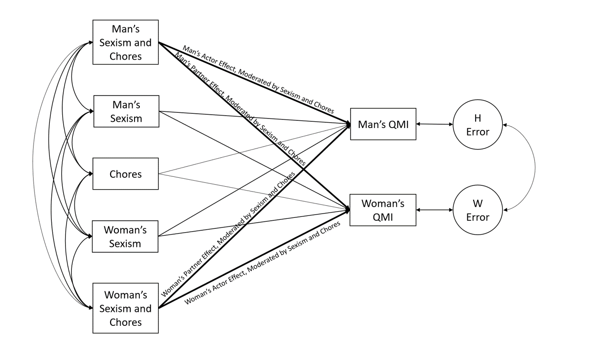

\begin{table}
\centering
\begin{tabular}{l|l|r|l|r|r|l}
\hline
\multicolumn{1}{c|}{ } & \multicolumn{3}{c|}{Man} & \multicolumn{3}{c}{Woman} \\
\cline{2-4} \cline{5-7}
Variable & Value\_M & T\_M & P\_M & Value\_W & T\_W & P\_W\\
\hline
Gender & -0.46 & -0.24 & 0.81 & 2.52 & 1.14 & 0.26\\
\hline
Time & >-0.01 & -0.05 & 0.96 & -0.01 & -2.39 & .02*\\
\hline
Partner's Percent of Chores (PC) & 1.43 & 0.76 & 0.45 & -1.01 & -0.45 & 0.65\\
\hline
Actor's PC & 1.86 & 0.97 & 0.33 & -1.51 & -0.69 & 0.49\\
\hline
Actor's Hostile Sexism (HS) & -0.08 & -0.44 & 0.66 & 0.05 & 0.24 & 0.81\\
\hline
Actor's Benevolent Sexism (BS) & 0.49 & 0.98 & 0.33 & 0.38 & 1.14 & 0.26\\
\hline
Partner's HS & 0.44 & 2.32 & .02* & -0.13 & -0.64 & 0.52\\
\hline
Partner's BS & -0.23 & -0.80 & 0.42 & -0.48 & -0.82 & 0.41\\
\hline
Actor's PC x Actor's HS & -0.08 & -0.44 & 0.66 & -0.07 & -0.33 & 0.74\\
\hline
Partner's PC x Actor's HS & 0.11 & 0.65 & 0.51 & 0.24 & 1.05 & 0.39\\
\hline
Actor's PC x Partner's HS & -0.15 & -0.76 & 0.45 & 0.22 & 1.11 & 0.27\\
\hline
Partner's PC x Partner's HS & -0.41 & -2.27 & .02* & -0.02 & -0.10 & 0.92\\
\hline
Actor's PC x Actor's BS & -0.53 & -1.05 & 0.3 & -0.11 & -0.34 & 0.74\\
\hline
Partner's PC x Actor's BS & -0.57 & -1.15 & 0.25 & -0.39 & -1.14 & 0.25\\
\hline
Actor's PC x Partner's BS & 0.18 & 0.63 & 0.55 & 0.36 & 0.63 & 0.53\\
\hline
Partner's PC x Partner's BS & 0.40 & 1.40 & 0.16 & 0.37 & 0.63 & 0.53\\
\hline
\multicolumn{7}{l}{\textsuperscript{*} indicate a p-value lower than our alpha of .05}\\
\end{tabular}
\end{table}

# Results

## Analysis Strategy

In romantic partnerships, each individual has influence on the other person, and often, mutual influence is also a key part of their relationship. This shared influence violates one of the common assumptions for running statistical models: independence of residuals. In this study, we used the APIM [@Kenny] in order to account for the mutual influence that romantic partners may share with each other.

The APIM addresses this interdependence by looking at both actor effects and partner effects. In the model, there are two individuals, each with an independent and a dependent variable. *Actor effects* focus solely on one individual, and describe the effect that the independent variable has on the dependent variable, regardless of the other person. *Partner effects* describe the effect that the other person’s independent variable has on this individual’s dependent variable. When dyad members have distinguishable characteristics, such as in the case of heterosexual couples, there are two actor effects and two partner effects. 

In order to account for the lack of independence in the residuals, the APIM creates two correlations. The first correlation is between the two independent variables, and can be seen as the curved line connecting them on the far left of the figure. The second correlation is the residual non-independence on the dependent variables, which can be seen as the correlation between the errors for both individuals. These correlations and errors allow the APIM to account for the non-independence of the residuals.

In our study, gender was our distinguishing variable, meaning that we focused on the effects of the man and the woman within each dyad. Our explanatory variables were HS and BS, our outcome variable was the feeling of teamliness on any given day, and each individual’s percentage of the total daily household chores was a moderating variable. Figure 1 shows a simplified version of our model that doesn’t include time and consolidates HS and BS as sexism. Note that in reality, HS and BS would interact with each other both for the actor and the partner, creating a much more complex model.

## Results

Our initial model investigated all of the possible interactions, looking at both the actor and partner effects, and accounting for HS and BS, teamliness, and the percentage of daily household chores (see Table 1). Based on our hypotheses, the main interactions that we wanted to look at were the relationship between the actor and the partner’s HS/BS and their feelings about the quality of their relationship and the relationship between the HS/BS of the actor, the percentage of daily chores that they and their partner performed, and their feelings about the quality of their relationship. The significant terms that remained were gender interacted with time, gender interacted with HS of the partner, and gender interacted with the partner’s daily percentage of chores performed and the partner’s HS. We then began reducing the model by only including the significant terms listed above, as well as the interaction between gender and the partner’s daily percentage of chores in order to include the main effects. 

This model found that over time, when holding all other variables constant (the man performs no chores), the woman felt less like a team with her partner (p = .0058). It also found the partner effects of HS for the man made his feelings of teamliness higher when his partner was not performing any chores (p = .0265). However, the effect of the interaction between gender, the partner’s daily percentage of chores performed, and  the partner’s HS, which was statistically significant in the previous model, was no longer significant in the reduced model. 

Since this interaction was not significant we removed it and ran a new model with only gender, gender interacted with time, gender interacted with the partner’s HS, and gender interacted with the partner’s daily percentage of chores. This new model confirmed the results from before, but also added new findings: the male partner’s effect of daily percent of chores performed decreased the woman's feeling of teamliness (p = .0011). 

\newpage

# References

\begingroup
\setlength{\parindent}{-0.5in}
\setlength{\leftskip}{0.5in}

\endgroup

We used R [Version 4.1.3; @R-base] for all our analyses.

\newpage

**Figure 1**

*Representation of our APIM Model

*Note.*For simplicity, time was not included and HS and BS were simplified as sexism. In reality, HS and BS would interact with each other for both the actor and the partner.
